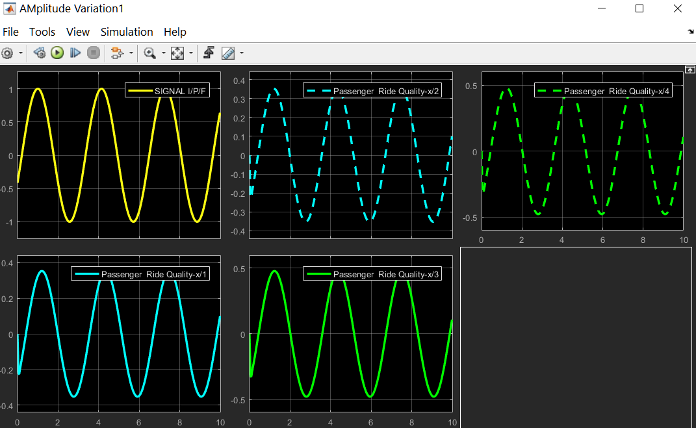

# Vehicle_Suspension_System
Simulation of vehicle suspension system in MATLAB and calculating the comfort level of the passenger from the seat arrangement.

<h2>Input data</h2>

<h2>Model</h2>

<h3>Ride Quality</h3>

In the above figure shows the passenger comfort, more the amplitude less the comfort and less the amplitude more the comfort.

